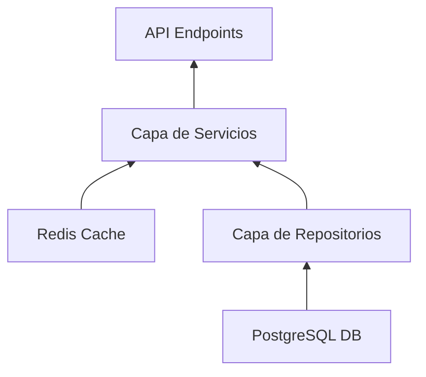
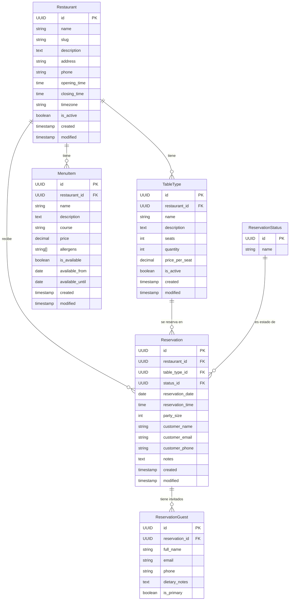

# Plataforma de Reservas de Restaurantes - Backend (Examen Final)

Este es el backend para la Plataforma de Reservas de Restaurantes (Opción C) utilizando una arquitectura desacoplada con Django (para la administración) y FastAPI (para la API pública).

##  Cómo ejecutar el proyecto

Todo el entorno está contenerizado y solo requiere Docker y Docker Compose.

1. Clona el repositorio y entra a la carpeta raíz.
2. Crea tu archivo de entorno copiando el de ejemplo:
   ```bash
   cp .env.example .env
   ```
3. Levanta los contenedores:
   ```bash
   docker compose up -d
   ```
4. Espera unos 30 segundos a que la base de datos se inicialice y se inserten los datos semilla automáticamente.
5. Los servicios estarán disponibles en:
   - **Frontend**: http://localhost/
   - **Panel de Django Admin**: http://localhost/admin/ (Credenciales por defecto: `admin` / `admin`)
   - **API Pública (FastAPI)**: http://localhost/api/v1/restaurants/
   - **Documentación de la API**: http://localhost/api/docs

---

##  Cómo ejecutar las pruebas (Tests)

El proyecto incluye configuraciones de `pytest` en la raíz para ejecutar simultáneamente las pruebas de Django y FastAPI, respetando el requerimiento del examen de correr los tests desde la raíz del repositorio.

Las pruebas de FastAPI usan `Mocks` (simulaciones) para los repositorios para garantizar que prueban la lógica de negocio aislada de la base de datos (Unit Testing estricto).

1. **Vía Docker (Recomendado):**
   ```bash
   docker compose exec fastapi pytest
   docker compose exec django pytest
   ```
2. **Localmente:**
   Asegúrate de instalar primero los requerimientos y luego correr el comando:
   ```bash
   pip install -r Django/requirements.txt -r FastApi/requirements.txt
   pytest
   ```

---

##  Gráfico de Dependencias (Dependency Graph)

A continuación se muestra el diagrama de dependencias que ilustra cómo los controladores (API) dependen de la capa de Servicios, la cual a su vez coordina la información entre la base de datos y la memoria caché.



---

##  Diseño de Base de Datos (Diagrama ER)

Todas las tablas de dominio están aisladas en el esquema `content` de PostgreSQL.



---

##  Decisiones de Diseño

1. **Runtimes Desacoplados**: FastAPI no depende del runtime de Django. Se conecta a la base de datos usando `asyncpg` para maximizar la concurrencia en lectura. Django se encarga exclusivamente de las migraciones del esquema y de la escritura a través del panel de Administración.
2. **Esquemas de PostgreSQL**: Los modelos de dominio residen estrictamente en el esquema `content`, separándolos de las tablas nativas de Django (como `auth_user` o `django_migrations`) que viven en `public`.
3. **Caché y Graceful Degradation**: Redis actúa como caché de lectura. Si Redis se cae o es inaccesible, FastAPI intercepta la excepción, loguea un *warning*, y continúa sirviendo las peticiones directamente desde PostgreSQL, asegurando un 100% de disponibilidad.
4. **Principios SOLID (MANDATORIO)**: Se implementó fuertemente el Principio de Inversión de Dependencias. La capa de Servicios, Repositorios y Caché dependen estricta y únicamente de Clases Abstractas Base (`AbstractBaseClass` en `FastApi/interfaces/`). FastAPI utiliza `Depends()` para inyectar las clases concretas cumpliendo sus respectivas interfaces.
5. **Lógica de Negocio (MANDATORIO)**:
   - **Control de Capacidad (Inventory Enforcement)**: Se realiza dinámicamente en lectura. El sistema calcula las mesas disponibles sumando el tamaño de las reservas (`party_size`) en la franja horaria solicitada y restándolo de la capacidad total del tipo de mesa. Al hacerlo a través de `SUM()` en SQL, garantizamos respuestas correctas ante lecturas concurrentes sin necesidad de usar bloqueos de fila (*row locks*).
   - **Filtro de Ventana de Tiempo**: El endpoint de disponibilidad valida las zonas horarias usando `zoneinfo` nativo de Python para calcular dinámicamente rangos de fechas (como "hoy" o "próximos 7 días") según el parámetro `tz` recibido.

##  Trade-offs (Compromisos)

- **Invalidación de Caché por TTL vs Basada en Eventos**: Elegí invalidar la caché utilizando un Tiempo de Vida (TTL de 300 segundos) en lugar de una arquitectura orientada a eventos (por ejemplo, enviar un mensaje por RabbitMQ cuando Django guarde un dato). **Trade-off**: Esto simplifica dramáticamente la arquitectura y evita fallos distribuidos, a costa de que la API pública podría devolver datos "viejos" durante un máximo de 5 minutos luego de una edición en el Admin.
- **Cálculo de Capacidad Dinámico**: Elegí calcular los cupos disponibles "al vuelo" con `SUM()` en lugar de mantener una columna estática de `cupos_disponibles` que se actualice en cada reserva. **Trade-off**: Evita por completo las *race conditions* (condiciones de carrera) entre reservas sin complicar la base de datos, aunque podría suponer una pequeña penalidad de rendimiento si hubiera que evaluar millones de reservas simultáneas.

##  Qué haría diferente con más tiempo

1. **Paginación por Cursor**: Actualmente utilizo `offset/limit` para paginar resultados. En tablas muy grandes, esta paginación se vuelve lenta en las últimas páginas. Cambiaría a *Cursor-based pagination* usando UUIDs secuenciales o marcas de tiempo para mejor estabilidad.
2. **Invalidación de Caché en Tiempo Real**: Implementaría `LISTEN/NOTIFY` directo en PostgreSQL. Cuando Django cambie un registro, Postgres notificaría a FastAPI de forma asíncrona para que borre el registro de Redis instantáneamente, asegurando 0% de estancamiento.
3. **Rate Limiting**: Agregaría `slowapi` en FastAPI para restringir el número de peticiones por IP, previniendo abusos y *scraping*.

---

##  Notas de Entrega (Submission Notes)

- **De lo que estoy más orgulloso**: La estricta implementación de los principios **SOLID**, logrando desacoplar totalmente las capas de Caché y Base de datos usando *Abstract Base Classes* de Python puro mientras se mantiene un alto rendimiento asíncrono.
- **De lo que estoy menos satisfecho**: El solapamiento inicial de nombres de paquetes (`core`) entre las carpetas de Django y FastAPI, lo que requirió un re-nombramiento a `fastapi_core` al final para evitar colisiones de dependencias (namespace collisions) al ejecutar `pytest` de forma global.