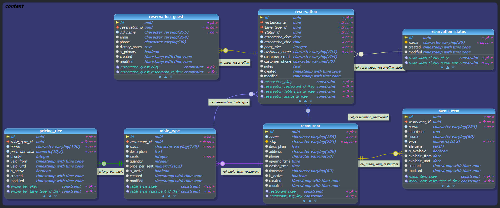
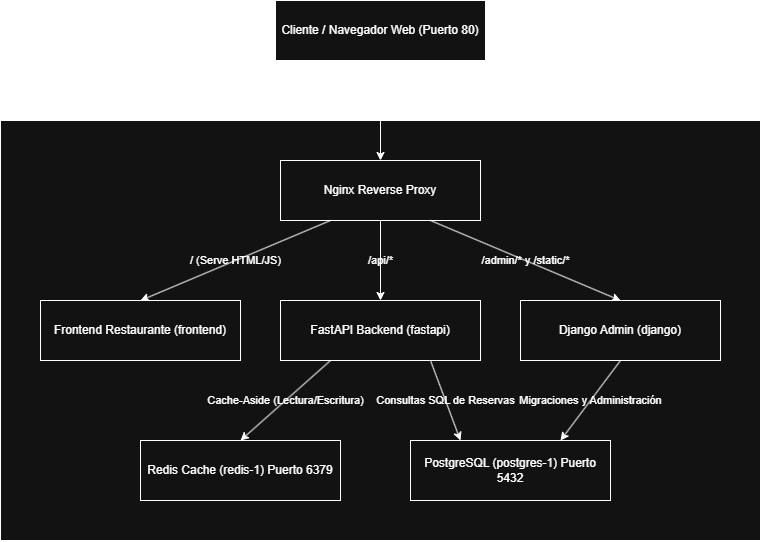

# Backend de Reservas para Restaurantes

Este repositorio contiene la entrega final del backend para el dominio de **Reservas de Restaurante** (Opción C). Provee un panel de administración basado en Django para las operaciones y un servicio de solo lectura en FastAPI de alto rendimiento para el consumo público. Todo se ejecuta detrás de un proxy inverso Nginx.

##  Cómo ejecutar

Toda la infraestructura está en contenedores. Para ejecutar el proyecto:

1. Clona el repositorio.
2. Asegúrate de tener instalados Docker y Docker Compose.
3. (Opcional) Copia `.env.example` a `.env` si deseas modificar las credenciales por defecto.
4. Ejecuta el siguiente comando desde la raíz del repositorio:

```bash
docker compose up
```

Espera unos 30 segundos para que los contenedores se construyan e inicialicen. **En el primer inicio, la base de datos se migrará y poblará automáticamente con 300 reservas y 150,000 invitados.**

### Endpoints Expuestos
- **Panel de Admin (Django)**: [http://localhost/admin/](http://localhost/admin/) (Credenciales: `admin` / `admin`)
- **Endpoints de FastAPI**: [http://localhost/api/v1/restaurants/](http://localhost/api/v1/restaurants/)
- **Documentación OpenAPI (FastAPI)**: [http://localhost/api/docs](http://localhost/api/docs)
- **Frontend**: [http://localhost/](http://localhost/)
- **Página 404 Personalizada**: [http://localhost/this-does-not-exist](http://localhost/this-does-not-exist)

---

##  Cómo probar

Las pruebas están escritas usando `pytest`. Hay al menos 5 pruebas significativas tanto para el servicio de Django como para el de FastAPI.

Para ejecutar las pruebas, utiliza el siguiente comando desde la raíz del repositorio:
```bash
docker compose exec django pytest
docker compose exec fastapi pytest
```
Alternativamente, si tienes tu entorno virtual configurado localmente, simplemente ejecuta `pytest` desde el directorio raíz.

---

---

##  Diseño de la Base de Datos 




##  Diagrama de Sistema





##  Decisiones de Diseño y Arquitectura

1. **Separación de Responsabilidades**: Django se utiliza estrictamente para el panel de Administración (Operaciones de escritura), mientras que FastAPI maneja la API pública (Operaciones de lectura). FastAPI **no depende** de Django en tiempo de ejecución.
2. **Principios SOLID**: 
   - **Inversión de Dependencias**: FastAPI depende de clases base abstractas (Protocolos) para los repositorios y la caché.
   - **Inyección de Dependencias**: Usamos `Depends` de FastAPI para la inyección en el constructor.
   - **Responsabilidad Única**: La lógica de negocio vive estrictamente en la capa `services/`, las consultas SQL en `repositories/`, y los enrutadores solo manejan el parseo HTTP.
3. **Esquema de Base de Datos**: Todos los modelos del dominio residen en un esquema `content` dedicado en PostgreSQL, completamente aislado de las tablas por defecto de Django en el esquema `public`. Usamos `UUID` para todas las claves primarias.
4. **Caché y Degradación Elegante (Graceful Degradation)**: Redis se usa para lógica Cache-Aside en los endpoints de listado y detalle. 
   - **Estrategia de Invalidación**: Se utiliza una estrategia de invalidación basada en Tiempo de Vida (TTL) (ej. 5 minutos). Esto es ideal para endpoints de alta concurrencia orientados a lectura donde la consistencia eventual es aceptable. Se omitió la invalidación dura al escribir para mantener FastAPI completamente desacoplado de las señales (signals) de Django.

5. **Manejo de Zonas Horarias (Timezones)**: La lógica de negocio respeta las zonas horarias. Los restaurantes tienen un campo `timezone` y las consultas (como el filtrado por ventana de tiempo) aceptan un parámetro `tz` (por defecto UTC) para calcular la disponibilidad con precisión.

### Lógica de Negocio Obligatoria Implementada
- **Control de Inventario / Capacidad**: El endpoint `/api/v1/reservations/availability/` calcula correctamente los asientos disponibles restando los asientos actualmente reservados de la capacidad física total de los tipos de mesa.
  - **Manejo de Condiciones de Carrera (Race Conditions)**: Para manejar lecturas concurrentes con precisión, la API calcula la disponibilidad dinámicamente usando consultas SQL agregadas (`SUM(party_size)`) en el momento exacto de la petición de lectura. Esto asegura que las lecturas concurrentes siempre vean el estado absolutamente más reciente de la base de datos sin mantener bloqueos (locks) prolongados. Las condiciones de carrera en escritura (dobles reservas) se manejan de forma nativa mediante bloqueos a nivel de fila (row-level locks) de PostgreSQL y Django del lado del panel de administración.
- **Filtrado por Ventana de Tiempo**: El endpoint de disponibilidad acepta ventanas como `"next7days"` y las calcula con precisión según la zona horaria solicitada.


---

##  Trade-offs (Compensaciones)

- **Síncrono vs. Asíncrono**: El ORM de Django es inherentemente síncrono, lo cual está bien para el panel de administración. Sin embargo, para FastAPI eludimos por completo el ORM de Django y utilizamos `asyncpg` para lograr máxima concurrencia y velocidad pura en la API pública. El trade-off es tener que escribir SQL crudo en los repositorios de FastAPI en lugar de reutilizar modelos ORM.
- **Población Masiva de Datos (Seed Data)**: Generar 150,000 invitados afecta drásticamente la memoria RAM si se hace de forma ingenua. Cambié la simplicidad del script a favor del rendimiento utilizando `bulk_create` en lotes de 5000 registros a la vez.

---

## Qué Haría Distinto con Más Tiempo

1. **Limitación de Tasa (Rate Limiting)**: Implementaría "Rate limiting" basado en IP en los endpoints públicos de FastAPI usando Redis para prevenir abusos (Extra Credit).
2. **Implementar mas separacion** : Actualmente el codigo esta separado entre capas pero en las propias capas hay cosas que se podrian arreglar para tener mejor separacion como separar los servicios en similares ademas que esta un poco forzado las clases abstractas , ademas yo agregaria en repositorio una clase mas encargada de hacer mockups 
3. **Validaciones** : Actualmente hay muy pocas validaciones en los endpoints , me gustaria agregar mas validaciones a futuro
4. **Entender algo mejor la logica del negocio** : Aunque implemente la logica de negocio que se pedia en el enunciado , nunca entendi bien que queria exactamente o para que y en la parte del frontend no me quedaba claro donde se implementaban las 3 opciones que teniamos 

---

##  Entregable (Más Orgulloso y Menos Feliz)

**De qué estoy más orgulloso**: Lograr separar Redis a través de un decorador para así no tener que implementarla en cada clase, como se nos mostró en la práctica de FastAPI. Además, estoy orgulloso de haber implementado lo requerido en el tiempo dado, aunque con algunas falencias como parte de separación y entendimiento del negocio que creo que me faltó.

**De qué estoy menos feliz**: Me cuesta mucho programar en inglés porque, más que todo, me olvido qué decía o qué otra cosa tenía implementada más fácilmente cuando es ese idioma, y lo mismo con la base de datos (me olvido cómo se llaman o si están; es como si tardara un rato en entender). Además, otra cosa que no me gustó es cómo me quedó el código, especialmente del servicio que se pidió implementar en mi caso (time-window filtering), ya que contiene mucha lógica a mi parecer y se pudiera haber separado mejor. También no estoy muy feliz con la organización de las clases; creo que eso es un punto de mejora. Otra falencia que me di cuenta es que me cuesta implementar la lógica de FastAPI porque me tardo un rato en saber dónde empezar, especialmente si me dieron un frontend ya hecho y me tengo que adaptar a ese.